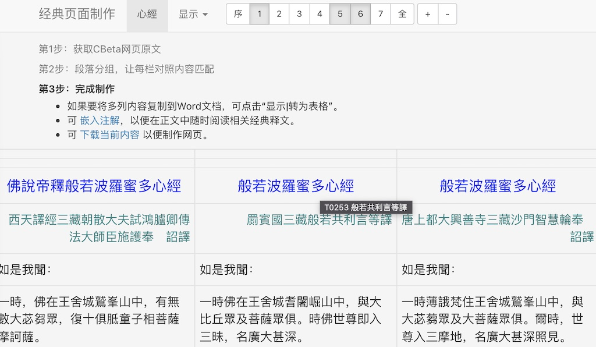

# cb-study

使用简易的纯前端技术(jQuery+Bootstrap+jsTree)展示学修经典，可在本地打开阅读。
- 支持双版本比对阅读，同步滚动
- 支持科判导航（侧边栏、文中、底部科判路径）
- 文中可嵌入注解，可交互显示注解
- 比对结果可复制到Word文档

## 在线预览
- [《起信论》](http://ggbstudy.top/cb/T1666.html): 梁唐译文对照，有科判导航，嵌入義記、裂網疏的注解
- [《心经》](http://ggbstudy.top/cb/T0251.html): 七种版本对照
- [《楞嚴經 卷四》](http://ggbstudy.top/cb/T0945_4.html) [《卷五》](http://ggbstudy.top/cb/T0945_5.html): 嵌入正脉疏、文句的注解

## 制作工具(maker)

基于[CBeta](https://cbetaonline.cn)原文制作，制作工具使用 Python+Tornado 实现简易的存储管理。

- 安装了 Python 3.6+ 后，使用下面某一种方式安装其余模块：
  ```shell
  pip3 install -r requirements.txt
  python3 -m pip install -r requirements.txt
  ```

- 运行脚本，打开 http://<ip>:8002 浏览页面
  ```shell
  python3 main.py
  ```

- 标引步骤

  1. 从CBeta获取网页原文，并自动标记内容
  
  

  2. 将多个版本的经典内容进行段落拆分和分组，建立对照关系
  
  

  3. 对合并后的页面内容进行注解嵌入等更多处理，或导出网页
  
  

  

  TODO: 加入科判标引功能

## 开源协议

没有任何版权限制，欢迎共同完善、改编和分享。

## 参考资料

- [Bootstrap 组件说明](https://v3.bootcss.com/components/)
- [Tornado 官方文档中文版](https://tornado-zh.readthedocs.io/zh/latest/)
- [SweetAlert 消息框文档](https://sweetalert.js.org)
- [jQuery contextMenu 文档](https://swisnl.github.io/jQuery-contextMenu/docs.html)
